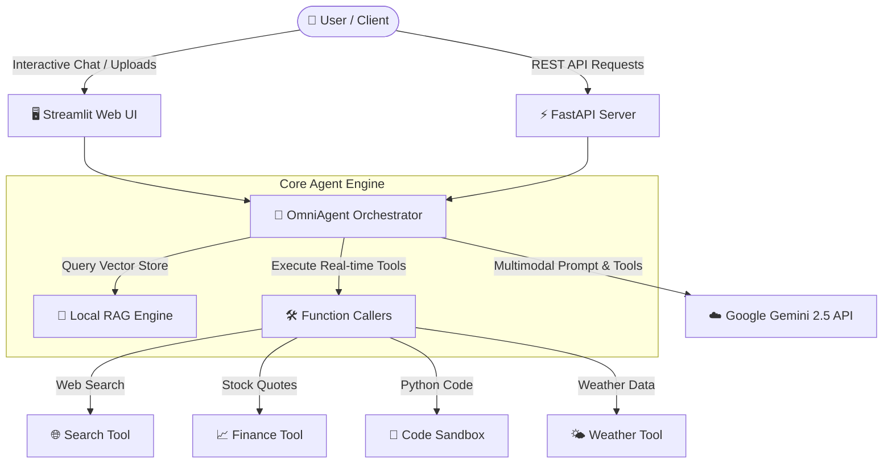

# 🤖 Omni-Agent Hub: Multimodal AI Agent & Local RAG Platform

[](https://www.python.org/downloads/)
[](https://aistudio.google.com/)
[](https://fastapi.tiangolo.com/)
[](https://streamlit.io/)
[](LICENSE)

An enterprise-ready, **100% local, zero-cost AI Agent platform** built using the official Google GenAI SDK (`google-genai`), Streamlit, FastAPI, and a local Retrieval-Augmented Generation (RAG) engine.

Designed for AI/ML engineers to showcase practical experience in:
- **Multimodal AI Reasoning** (Image + Text prompts with Gemini 2.5 Flash / Pro)
- **Tool Calling & Function Execution** (Web Search, Math, Financial Data, Python Sandbox)
- **Local RAG & Vector Retrieval** (PDF & TXT document chunking & similarity search)
- **Fullstack AI Architecture** (Interactive Streamlit Dashboard + FastAPI REST Service)

---

## 📐 System Architecture



---

## ✨ Key Features

1. 💬 **Multimodal Conversational Agent**: Analyze attached images alongside structured text queries using `gemini-2.5-flash`.
2. 🛠️ **Automated Tool Calling**: Gemini automatically determines when to call registered Python tools (Calculator, Web Search, Stock Quote, Code Executor) and executes them seamlessly.
3. 📄 **100% Local RAG Engine**: Upload PDF or TXT documents, extract text, chunk content, and perform cosine similarity search with zero external vector database expenses.
4. ⚡ **Production REST API**: FastAPI server exposing endpoints for external application integration, health checks, and document indexing.
5. 💻 **Runs 100% Locally on your Laptop**: Zero hardware or paid cloud service requirements. Works with the **Free Gemini API Tier**.

---

## 🚀 Quick Start (Run on your Laptop)

### 1. Clone & Install Dependencies

```bash
# Clone the repository
git clone https://github.com/your-username/omni-agent-hub.git
cd omni-agent-hub

# Create a virtual environment
python3 -m venv venv
source venv/bin/activate

# Install dependencies
pip install -r requirements.txt
```

### 2. Configure Environment Variables

Create a `.env` file in the root directory (or copy from `.env.example`):

```bash
cp .env.example .env
```

Add your free Gemini API Key from [Google AI Studio](https://aistudio.google.com/):

```env
GEMINI_API_KEY=your_free_gemini_api_key_here
```

*(Note: The app will run in offline demo mode even without an API key!)*

---

## 🖥️ Running the Applications

### Launch Interactive Streamlit UI

```bash
streamlit run app.py
```
*Open [http://localhost:8501](http://localhost:8501) in your browser.*

### Launch FastAPI REST Service

```bash
python api.py
```
*Interactive Swagger API Docs will be available at [http://localhost:8000/docs](http://localhost:8000/docs).*

---

## 🧪 Running Automated Tests

```bash
pytest tests/ -v
```

---

## 📂 Project Structure

```
omni-agent-hub/
│
├── agent/
│   ├── core.py           # OmniAgent orchestrator using Google GenAI SDK
│   ├── tools.py          # Python functions registered for Gemini Function Calling
│   └── rag.py            # Local PDF/TXT RAG chunking and vector search
│
├── tests/
│   ├── test_agent.py     # Unit tests for tools and calculations
│   └── test_rag.py       # Unit tests for RAG chunking & query retrieval
│
├── .github/workflows/
│   └── ci.yml            # GitHub Actions CI pipeline
│
├── app.py                # Streamlit Web Dashboard UI
├── api.py                # FastAPI REST API Backend
├── config.py             # App settings & environment loader
├── requirements.txt      # Python package dependencies
├── .env.example          # Sample environment variable template
├── LICENSE               # MIT Open Source License
└── README.md             # Project documentation
```

---

## 💡 Learning Takeaways & Portfolio Highlights

Building and reviewing this repository demonstrates key competencies in modern AI Engineering:

1. **Google GenAI SDK Integration**: Direct usage of `from google import genai` with `types.GenerateContentConfig`.
2. **Function Calling Architecture**: Defining typed Python functions with docstrings that the LLM autonomously inspects and executes.
3. **Retrieval-Augmented Generation (RAG)**: Implementing document processing, chunking strategies, and vector relevance matching.
4. **Decoupled System Design**: Separating AI logic (`agent/`), web frontend (`app.py`), and API services (`api.py`).

---

## 📜 License

This project is open-source under the [MIT License](LICENSE).
